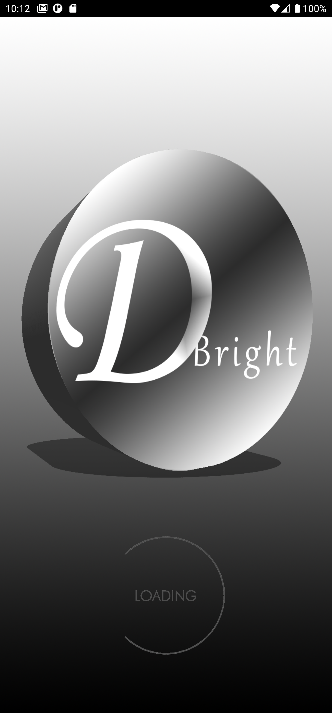

DTTS APPLICATION

DTTS application is
a powerful speech synthesis application that produces artificial
production of human speech by receiving text and converting the text to
speech\
In which it now has the ability to capture images and extract the text
to read for you , it also has the ability to read through camera , and
it can read in different languages\
\
*Product feature*\
\
• You have the ability read text by just pasting or typing the text in
it\
• it has the ability to calculate the number of seconds it takes to read
a lot of words\
• it has ability to calculate the number of words inserted on the entry
field\
• it has an image button that direct you to gallery whereby you can get
an image and it extract the text from it using OCR\
• you have the ability to read directly from your phone camera and even
edit the text after extracting it\
• it has a play button\
• it has a stop button which indirectly reset counter\
• it has a preview screen that preview images being selected\
• it can calculate the number seconds it takes to read

You can also read more about the features of the application on
[www.dbright.org](http://www.dbright.org)

Here are some screenshots on the application\

*Reasons for building the application*

Reason for the application created is to help in the pronunciation of
words, also in the reading of text in which it also has the ability to
tell you how many seconds it takes to pronounce or read a sentence, in
which the application is both useful for does with internet and
non-internet, because the only part of the application that requires
internet are the extraction of text from images

*Mode of Installation *

This Application can either be install directly from google store and
Samsung store or you can visit the main website which is
[www.dbright.org/dtts-download](http://www.dbright.org/dtts-download)

*Requirements*

Screen layouts small, normal, large, xlarge

Native platforms arm64-v8a, armeabi-v7a, x86, x86\_64

API levels 21+

Target SDK 30
